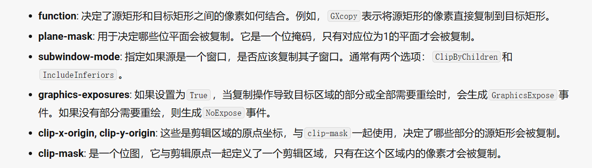

# 3.14使用体会

---

## 解决了一个bug

在前一天的使用中，发现存在一个将**pixmap**中的像素映像到另一个可绘制对象时，存在背景是混乱甚至非单色环境，经过分析检查发现在`X`中，**pixmap**并不会在开始时像**window**一样要求初始化，而是采用了直接分配一块内存给**pixmap**，并未进行*初始化*，这也就导致了原先内存中的图像（如果存在的话）或者混乱的像素分布存在**pixmap**中，因此，在使用时需要将该像素映像绘制背景防止显示异常（XCopyArea）纯粹是拷贝像素到目标区域。

---

## 深究XCopyArea

`XCopyArea`是一个用来拷贝一个源可绘制对象到目标可绘制对象的函数，其函数原型如下

```cpp
int XCopyArea(Display *display, Drawable src, Drawable dest, GC gc, int src_x, int src_y, unsigned int width, unsigned height, int dest_x, int dest_y);

int XCopyPlane(Display *display, Drawable src, Drawable dest, GC gc, int src_x, int src_y, unsigned width, int height, int dest_x, int dest_y, unsigned long plane);
```

---

函数名|XCopyArea|XCopyPlane
---|---|---
Display *display|对X的连接|同左
Drawable src,dest|可绘制对象（如窗口、像素图）|同左
GC gc|图形上下文|同左
int src_x,src_y|源对象的截取起始坐标|同左
unsigned width,height|源对象的截取矩形宽和高|同左
int dest_x,dest_y|目标对象的坐标|同左
unsigned long|该函数无此参数|用于拷贝像素某一平面

该函数将可绘制源对象复制到目标对象，参数gc的作用是采用gc中的部分组件包括**function**、**plane-mask**、**subwindow-mode**、**graphics-exposures**、**clip-x-origin**、**clip-y-origin**、**clip-mask**来完成像素的拷贝

---

以下是对各个参数的解释



---

## tile和stipple

图形上下文可以被设置为**tile**和**stipple**，分别表示平铺和点缀

平铺是上下文渲染图形的一个方式，在进行绘制的时候，平铺用来将所要绘制的对象用制定的一个像素图进行平铺，就像铺地砖一样，如果过大则重复铺设，直到铺完或者剩余不足以继续铺设，那么就会进行截断，在**X**中，平铺拥有最适合也就是最快速的执行速度大小，可以通过
`XQueryBestTile`函数来获取，同时，可以对一个**window**的背景和边界设置平铺来绘制这些属性

点缀是根据一个位图来绘制的，也就是在**GC**中，所绘制的图形是根据比特位是否设置来进行绘制的，在使用点缀有两种比较常用的方式

1. 设置的比特位将会被用前景绘制，没有被设置的位使用背景绘制
2. 设置的比特位仍然使用前景绘制，但是没被设置的位将会被忽略（也就是说保留原样）

与平铺不同的是，点缀只允许被运用于**GC**中，通常来说，点缀用来绘制线条或者字符

使用`XCreateBitmpFromData`函数创建一个位图

```cpp
Pixmap XCreateBitmapFromData(Display *display,Drawable d,char *data,unsigned int width,unsigned int height);
```